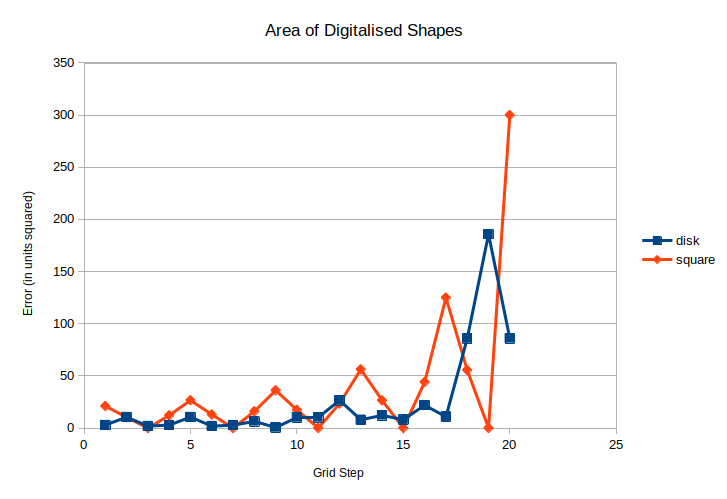
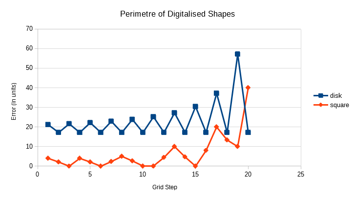

### Digital Geometry

##### M2 SIS, UGE

### Laboratory Session \#1

#### November 13th, 2020

----

### Experiments

#### Step 1

#####  Can we define a convex polygon using implicit functions?

We can express the shape of a convex polygon $P$ as:

$$
    P = \{(x, y) \in  \R^{2} : \forall f ∈ F,  f(x, y) \leq 0\}
$$

With $F$ a set of $n$ implicit functions, each defining a line,
and a half-plane in Cartesian coordinates. $a$, $b$ and $c$ are real numbers.

$$
    f(x, y) = ax + by + c
$$   

##### Can we exactly calculate the area and perimeter of such Euclidean shapes defined by
##### implicit functions? If so, please give their formulas in the report.

We can first compute the intersection of each lines which gives us the vertices of our polygon.
How we would proceed is, we would compute all the intersections of the lines (there are at most $2n$),
then find the closest one to the origin, we'll call it $p_{0}$.

We know that this intersection is a vertex of our polygon, because if it was not there would be
two other points further away from the origin, with a face in the direction of $p_{0}$
from the origin, and the shape would not be convex.

From there, we choose as $p_{1}$ the intersection with another line such that $p_{1}$ is the next closest to the origin.
This defines the direction of the traversal, and we follow up with the $p_{i}, i \in \llbracket 0, n \rrbracket$.

Once we have $(p_{i})_{i \in \llbracket 0, n \rrbracket}$, we can compute the perimeter $L$ of the polygon by the sum of le length of its sides (1-cells).
By acknowledging:

$$
    p_{n+1} = p_{0}
$$

We find:

$$
    L(p) = \sum_{i=0}^{n} |p_{i+1} - p_{i}|
$$

With the same convention on p, and with O the origin of our referential,
we can define a set of $n$ triangles by their respective vertices:

$$
    t_{i} = \{p_{i}, (0, 0) , p_{i+1}\}, i \in \llbracket 0, n \rrbracket
$$

The area covered by the $(t_{i})$ form a 'partition' of the area of P, we can thus write:

$$
    A(P) = \sum_{i=0}^{n} A(t_{i})
$$

With the area of the triangle being half of the product of its base and height.
The base $b_{i}$ is:

$$
    b_{i} = |p_{i+1} - p_{i}|
$$

The height $h_{i}$ is:

$$
    h_{i} =  \frac{|p_{i+1} + p_{i}|}{2}
$$

We find:

$$
    A(t_{i}) = \frac{b_{i} h_{i}}{2}
    \\
    A(t_{i}) = \frac{1}{4} |p_{i+1} - p_{i}| |p_{i+1} + p_{i}|
$$

And thus:

$$
    A(P) = \frac{1}{4} \sum_{i=0}^{n} |p_{i+1} - p_{i}| |p_{i+1} + p_{i}|
$$

Note that the above formula does not depend on the Euclidean metric used.
In case of an L2 norm, we can simplify it like so:

$$
    A(P) = \frac{1}{4} \sum_{i=0}^{n} \sqrt{(p_{i+1}^{2} - p_{i}^{2})^{2}}
         = \frac{1}{4} \sum_{i=0}^{n} |p_{i+1}^{2} - p_{i}^{2}|
$$

##### Boundaries

##### Remarks

By increasing the grid size we also increase the digitalised circle's shape accuracy.
The digitalised square does not benefit from this,
because it is already identical to the original.

#### Step 3

Notes:
- Greater grid step means lower digital resolution.
- For the rest of this document, the square's size will be half of the disc's, the difference in scales.

As expected, we see that by reducing the grid step, we obtain more accurate shapes on average.

Once again, the Square shows more accurate results as the grid step decreases.
Perhaps less expected, the error of the Disc converges towards a non-null value.
As we saw in class, the perimeter of the sampled Disk should be
constant equal to that of a Square of the same dimensions,
because when reorganised, the curves are of the same length.

#### Step 4

The results are good for the digitalised convex shapes (which are not always convex themselves,
for instance the Disc is only starred). Indeed, the error that we get are due solely to the digitalisation
process.
However, using any other shapes would introduce an error.
For instance, using shapes with holes, or any concave shape.

#### Step 5

No changes with the Areas, we get the same results as with the original digital shapes.

The perimeter of the Square converges just like with the digital shape.
We can see that this time the perimeter of the Disc is more accurate,
it's clear when looking at the drawings, because we are using broken lines instead
of only using vertical and horizontal lines.
