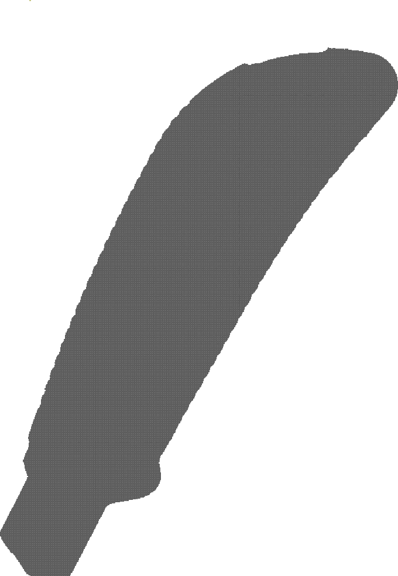
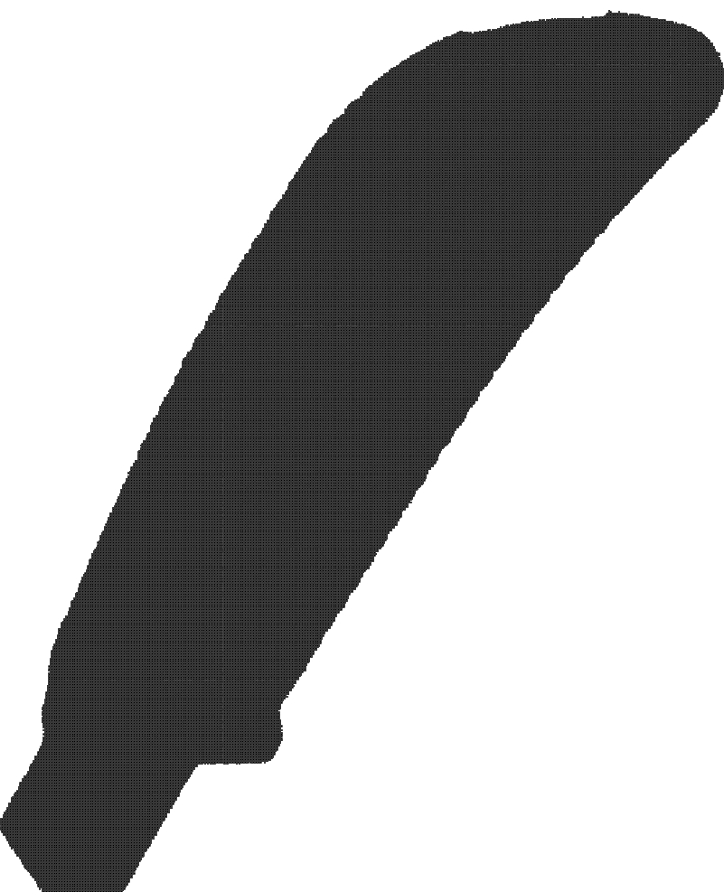

### Digital Geometry

##### M2 SIS, UGE

### Laboratory Session \#3

#### December 14th, 2020
----

### Experiments

#### Step 1

###### Describe the shapes and positions of the segmented objects.

The objects are non-convex, and one of them has holes.
The pictures capture the objects at the centre of the frames, each with a different rotation around their approximate geometric centre.

#### Step 2

We chose the adjacency pair (4, 8), because we do not have any obvious connectivity issues or with the binary image: it is well-composed.

#### Step 3

We chose the Kabsch algorithm for computing the rotation matrix, as it is the most accurate method of the three presented.

#### Step 4

We chose the backward model, because our objects are fully-connected. A forward model does not offer any insurance that the transformation of a fully-connected image will be fully-connected.

#### Step 5

With $S_1$ a shape in an image, $S_2^\prime$ another shape transformed to match $S_1$, the Hausdorff distance is defined like so:

$$
d_H(S_1, S_2^\prime) =  \max  \{ \sup \limits_{x \in S} \; \{ \inf \limits_{y \in S_2^\prime} d(x, y) \}, \sup \limits_{y \in S_2^\prime} \{ \inf \limits_{x \in S_1} d(x, y) \} \}
$$

The Debuisson-Jain dissimilarity measure is defined like so:

$$
d_D(S_1, S_2^\prime) =  \max  \{ \frac{1}{|S_1|}   \sum \limits_{x \in S_1} \; \inf \limits_{y \in S_2^\prime} d(x, y) , \frac{1}{|S^\prime|} \sum \limits_{y \in S_2^\prime} \inf \limits_{x \in S_1} d(x, y) \} \}
$$

Take a triangle shape with a large height, such that the summit is pointing towards the opposite direction of another shape, touching the triangle. The Hausdorff distance will unintuitively be of the order of the triangle's height, and will be very large, whereas the Dubuisson-Jain dissimilarity measure will be computed from the triangle's geometric centre and be smaller, which is more accurate.

As such the Debuisson-Jain dissimilarity measure is more robust in the sense that it is less sensible to outlying data because it uses an average, compared to the Hausdorff which uses a superior bound.

Both of these measurements can be done in $\theta(|S||S^\prime|)$ time from their definition.

The Distance transformation, which gives us the distance to the closest point outside of the shape for any point in the shape.
$$
f_y(x) = \inf \limits_{y \in S_2^\prime} d(x, y) \approx
$$

*Binary image of the knife shape.*

*Another binary image of the same knife shape transformed to match the first with a backward rigid transfomation.*
